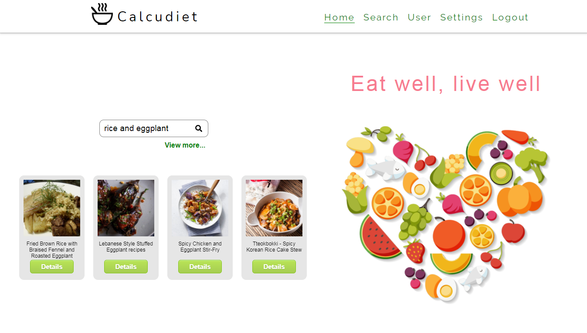
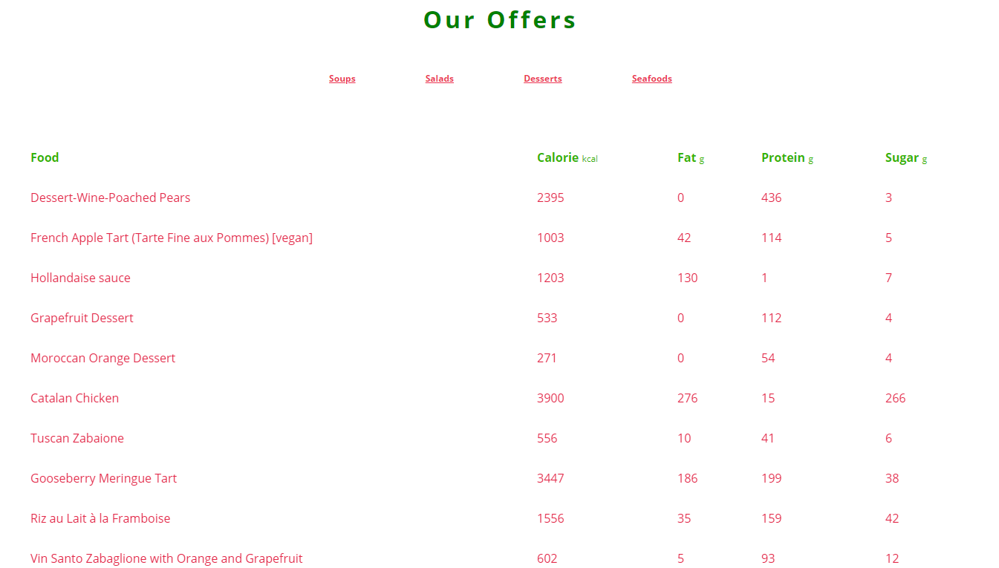
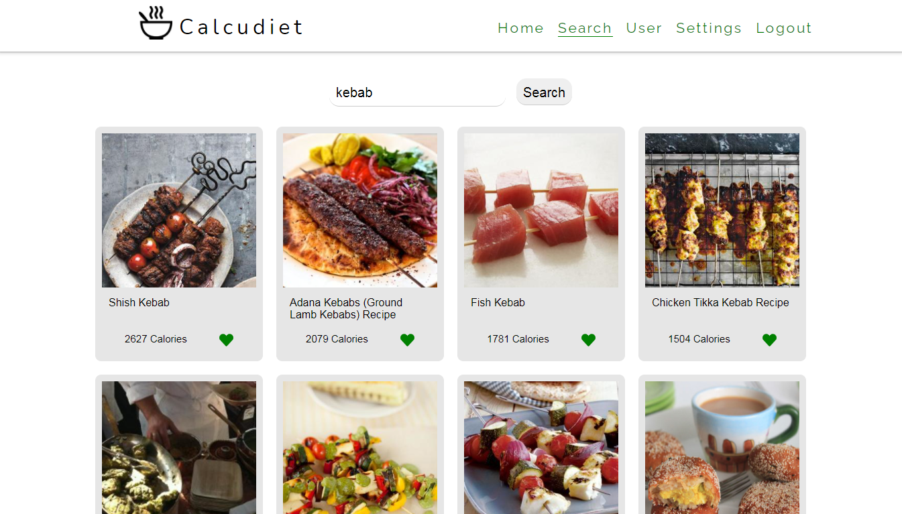
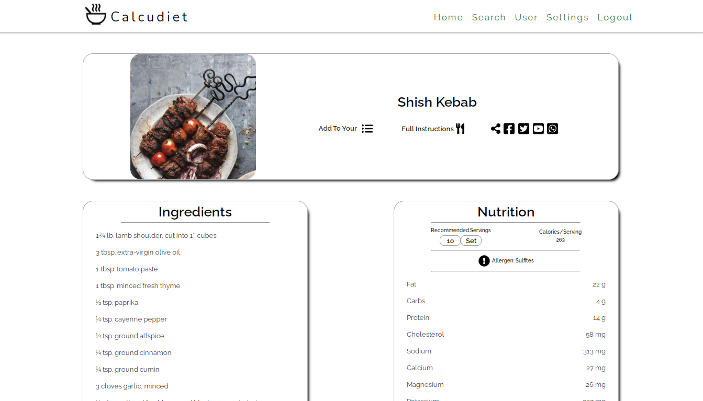
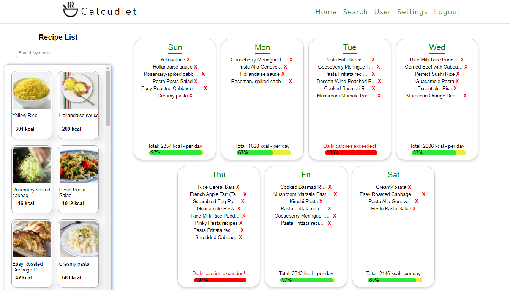

# Calcudiet

## [Live link of the project](https://determined-hodgkin-262833.netlify.app)

Calcudiet has been developed as a group project during Kodluyoruz İstanbul Earlybird Front-End Talent Bootcamp.

Users can search for recipes and see their details about calories, ingredients, nutritional value etc.

It provides login and sign up functionality via firebase authentication and it is possible to save or delete these recipes from users profiles via firestore.

It calculates body mass index of users and provides a weekly diet table to fill with recipes.

Drag and drop functionality provided for filling table and showing whether or not users exceed their calory limits.

It does not have any commercial purpose. API we used has a limit of 5 queries/minute, therefore it may cause a halt on live link.

## Technologies
* React
* JavaScript
* HTML 5
* SASS
* Firestore
* Firebase Authentication

